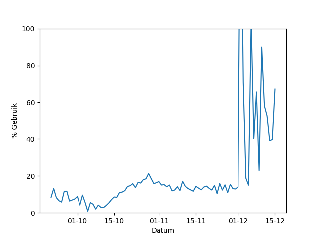

De overheid app "Corona Melder" wordt al een tijdje gebruikt in het oosten van het land, en nu ook nationaal, maar door hoeveel mensen eigenlijk? Er komen wel berichten naar buiten over het aantal downloads, maar een app downloaden betekend niet dat je hem ook gebruikt. Deze webpagina verzamelt alle data die door gebruikers van de app geüpload wordt nadat ze positief getest zijn, door te kijken hoeveel dit is kunnen we een inschatting maken van het daadwerkelijke gebruik. We zijn op 5 oktober 2020 begonnen met het verzamelen, omdat de data twee weken beschikbaar blijft hebben we alles vanaf 21 september kunnen downloaden. Dit zijn tot nu toe 265 sets aan data. We kunnen de hoeveelheid geüploade data vergelijken met het aantal positief geteste personen in de relevante regio (voor 10 oktober in de testregio, vanaf dan nationaal) om een inschatting te maken van het aantal gebruikers.

In een poging de privacy van de gebruikers te waarborgen word er, als er maar weinig nieuwe echte data is, nep data toegevoegd door de overheid. Echter wordt deze nep data op een manier gegenereerd die deels te onderscheiden is van de echte data. Een korte berekening maakt het mogelijk te schatten hoeveel echte gebruikers hun data hebben geüpload. Hierbij proberen we het aantal te overschatten, zodat we het meest positieve beeld neer zetten. Als er wel veel data is geüpload dan (over)schatten we het aantal uploads door het aantal dagen waarvoor data is door vijf te delen, immers zal het merendeel van de gebruikers meer dan vijf sleutels uploaden (de twee dagen voor de eerste symptomen tellen ook, en pas bij symptomen kan er een test aangevraagt worden, pas als die terug komt kan er geupload worden).

De afgelopen week lijkt het dat er 11789.400000000001 zieke gebruikers hun data hebben gedeeld. In de zelfde periode zijn er 67850 mensen positief getest in de regio. Dit betekend dat 17% van de mensen in de regio ook echt hun data deelt als ze ziek zijn. Als nogmaals zoveel mensen de app wel gebruiken om gewaarschuwd te worden (en vervolgens in quarantaine gaan), maar niet zelf hun data willen delen, dan zal de app voor 17% maal 35% = 6% van de ontmoetingen een effect kunnen hebben. Dit percentage gaat er wel vanuit de de ontmoeting niet al via andere middelen was gedetecteerd.

We kunnen het gebruik ook over tijd weergeven. Hieronder in het blauw het aantal positieve tests in de regio per dag, en in oranje het aantal uploads.

En hier het percentage gebruik over tijd.

Voor onderzoekers en programmeurs: er wordt een kopie van de dataset bijgehouden op [github](https://github.com/jorants/CoronaMelderCDN).

